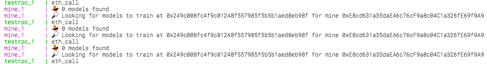

# hacky docker setup

> Workarounds needed until everything lands on `master`

## setup the local stuff

1. prepare mine.js
    1. `git checkout build/docker_compose`
    1. `docker build -t mine .`
1. `git clone git@github.com:OpenMined/PySonar.git`
    1. `git checkout build/use-npm-abi`
    1. `docker build -t sonar-notebook -f Dockerfile.notebook .`

## start docker environment

1. `docker-compose -f .docker/docker-compose.yml up`

You should see all sorts of logs and finally this:

This means the platform is running and the mine is waiting for a model to train.

Models will be submitted via the jupyter notebook, that first needs a few fixes..

## fix jupyter notebook

> Ignore all the instructions on the notebook

Some changes required to fix the docker environment (pending for merge):

> _cell meaning a block of code (not text blocks)_

1. open the notebook at [localhost:8888](http://localhost:8888/notebooks/Sonar%20-%20Decentralized%20Model%20Training%20Simulation%20(local%20blockchain).ipynb)
1. **cell 1** change `from syft.he.Paillier import KeyPair` to `from syft.he.paillier import KeyPair`
1. **cell 2** change last line to `repo = ModelRepository('0x249c008fc4f9c01248f557985f5b5b1aed8eb98f', ipfs_host='ipfs', web3_host='testrpc') # blockchain hosted model repository`

# Repair TODOs

> Stuff thats needs to get unhacky

0. `sonar-notebook` is based off `anoff/pysyft` because pysyft branch 