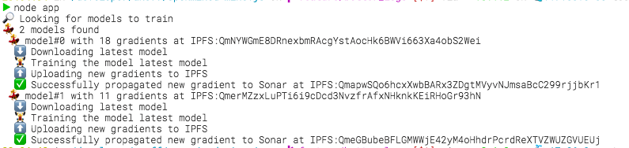

# mine.js 🗻⚒

[](https://travis-ci.org/OpenMined/mine.js)
[](https://codecov.io/gh/OpenMined/Mine.js)

> nodeJS implementation of an [OpenMined](http://openmined.org) data mine

- [⬆️ Setup](#-setup)
    - [🎬 Prerequisites](#-prerequisites)
    - [📦 Installation](#-installation)
- [🏃 Usage](#-usage)
    - [🏁 Start](#-start)
    - [🌙 Command Line Interface](#-command-line-interface)
    - [🐞 Known Issues](#-known-issues)
- [⚖️ License](#-license)

## ⬆️ Setup

### 🎬 Prerequisites

* the `npm install` requires a python executable `>= v2.5.0 & < 3.0.0` (child-dep of web3)
* The code was developed using node **v8.1.2** and it is recommend to stick around this version.

### 📦 Installation

```sh
# install this project
npm install
# in addition you need the syft python library installed
pip install git+https://github.com/OpenMined/Syft.git
```

## 🏃 Usage

### 🏁 Start

You need to start the following things before you can use your mine:
* blockchain (testrpc for now)
* ipfs daemon

This repository comes with a [docker-compose file](setup/docker-compose-dev.yml) that allows you to bootstrap _blockchain_, _ipfs_ and any other services via one command. This will also start an instance of the latest `openmined/mine.js:edge` docker container with all local files mounted into it.
This allows development on the code with an auto-reloading docker environment.

_It will not work if you install new dependencies as those are not hot-loaded. You have to restart the `mine.js` container to install new dependencies._

```sh
# to start the development environment
npm run dev
```

Alternatively you can only run the Mine (assuming you have testrpc and ipfs running somewhere):

```
 npm start -- --mine-address <your mine address> --contract-address <a sonar smart contract address>
```

You should see the following output:



If you have the docker setup running you can access the data scientist notebook at [localhost:8888](http://localhost:8888/notebooks/Sonar%20-%20Decentralized%20Model%20Training%20Simulation%20(local%20blockchain).ipynb) and add new models to the blockchain.
Models will be stored there until you call `docker-compose -f ./docker/docker-compose-dev.yml down`. Use `docker-compose .. stop` to stop the containers without removing any stored data.

### 🌙 Command Line Interface

To list available commands, execute `npm start -- --help`:

### 🐞 Known Issues

* connection to dockerized IPFS/testrpc containers outside the docker network are instable

## ⚖️ License

[Apache-2.0](https://github.com/OpenMined/mine.js/blob/master/LICENSE) by OpenMined contributors. If you have valid reason for us to consider going for a more permissive license please get in touch, we're not monsters 👾
